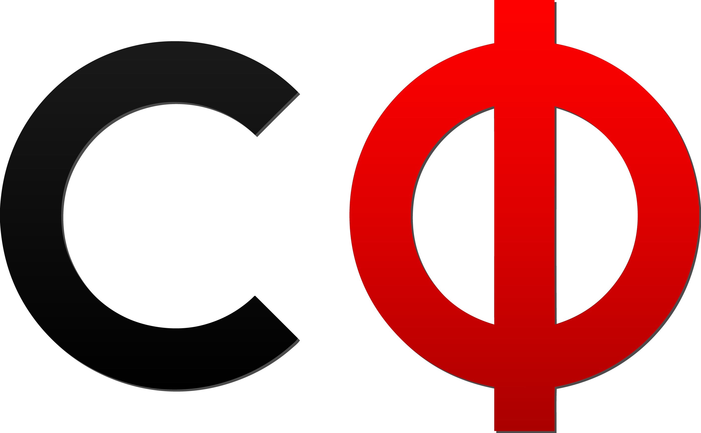
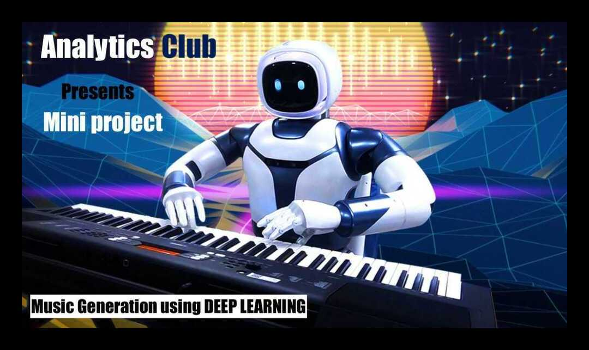

# Mini-Project 1 - Analytics Club, IIT Madras 

## Schedule

- Presession content till actual sessions start for self reading
- Actual sessions start from 11th May.
- Code Along session
- Developing the intuition of why the model works/what has the model learnt + simple/quick walkthrough of latest paper relevant to the same task.
- Doubt Session
  
## Content

1. [Pre-session Content](./presession/) 

2. **Session 1 - Introduction to ML, Nueral Networks**

- [slides](assets/Music%20Generation%20-%20Session%201.pptx) | [pdf](assets/Music%20Generation%20-%20Session%201.pdf) 

- Session recordings - [GRP-1](https://drive.google.com/open?id=1B-B6KpAyXoV8asUxk25Hs21pTzon3X8m) | [GRP-2](https://drive.google.com/file/d/1JO8ZQB4haw3-vBqcwabFHZGhPCm8NYLz/view) | [GRP-3](https://drive.google.com/file/d/1UB_stAfLnA2nrG3kgECaK1IhlB4E9pLz/view?ts=5eb927cd)

3. **Session 2 - Introduction to RNNs and LSTMs**

- [slides](assets/RNN%20and%20LSTM.pptx) | [pdf](assets/RNN%20and%20LSTM.pdf) 
- Session recordings - [GRP-1](https://drive.google.com/file/d/1SO2kZrhr2uylA8El4TyCggOcUoevzfFb/view?usp=drivesdk) | [GRP-2](https://drive.google.com/file/d/1DV474hNfRnEVCqlzx4K9W_kexgpbQHgD/view) | [GRP-3](https://drive.google.com/file/d/1cKZzFmcUZmNDUhKXafFpge_j4R3eTCSJ/view?ts=5eb95683)

## Links

**We will be having a dedicated doubt clearing session but till then feel free to post your doubts here [link](https://forms.gle/n5z5X1dnrcCyxzcD9)**

*We will reply to everyone's doubts via email or if relevant can be taken up in the next session as well.*

**Feel free to give us some feedback/suggestion regarding the session. You can also use this link to suggest topics/content we must take up in the next one. [link](https://forms.gle/pCbqWB9E1dztXPRU8)**